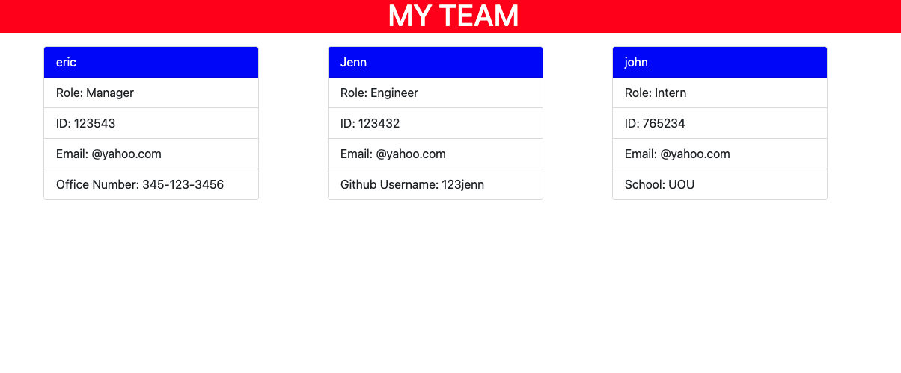

# Team Profile Generator

## Summary

- The Team Profile Generator is a command-line application that uses inquirer and node to retrieve information about employees, then generates an HTML file displaying cards of each employees information. 

## Get Started

- Clone the repository to your local machine and run npm install in the command line to install the dependencies required to run the application. 
- Type node index.js in the command line to bring up a series of questions. 
- Fill out each prompt for each employee and when all employees have been entered you can choose to complete the team which generates the HTML file.

## Technologies Used

- This application was created using Object-Oriented Programming

- The application is run by using node.js and uses the inquirer package for user prompts

- Jest is used to perform testing (Test-Driven Developement)

- HTML, CSS, Javascript

## Demo

## Demo Videos

#### Testing using Jest

https://drive.google.com/file/d/1rLjNUJjoH07mFcGFsNfGDpm4VtCqmzrZ/view

#### Functionality of Application

https://drive.google.com/file/d/1BG1FVSQ4eZ536YKiA3TL1jNFDr-6Kh00/view